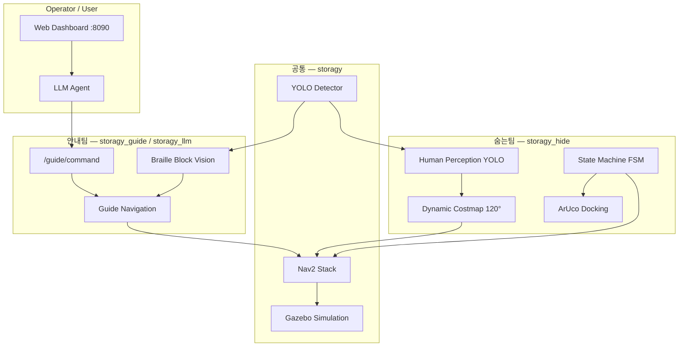

# Toy Guide — 시각장애인 안내 보조 AMR

[](https://docs.ros.org/en/humble/)
[](docker-compose.yml)
[](requirements.txt)
[](LICENSE)

**Toy Guide**는 실내 매장(카페·음식점)에서 평상시에는 구석 대기석에 은폐(Freeze)되어 있다가, 안내견과 함께 온 시각장애인 손님의 안내 임무를 교대(Take-over) 받아 **자율주행·비전·LLM**으로 목적지까지 안내하고 복귀하는 ROS 2 기반 AMR 시스템입니다.

> 자율주행전문가교육(xyz아카데미) 팀 프로젝트  
> 베이스: [storagy-simulation-system-docker](https://github.com/bluephysi01/storagy-simulation-system-docker) (Gazebo · Nav2 · YOLO · LLM · 웹 대시보드)

---

## 목차

- [핵심 기능](#핵심-기능)
- [시스템 아키텍처](#시스템-아키텍처)
- [기술 스택](#기술-스택)
- [저장소 구조](#저장소-구조)
- [사전 요구사항](#사전-요구사항)
- [빠른 시작](#빠른-시작)
- [실행 모드](#실행-모드)
- [환경 설정](#환경-설정)
- [개발 가이드](#개발-가이드)
- [ROS 인터페이스](#ros-인터페이스)
- [실제 로봇 배포](#실제-로봇-배포)
- [문서](#문서)
- [라이선스](#라이선스)

---

## 핵심 기능

| 단계 | 동작 | 담당 모듈 |
|------|------|-----------|
| **1. 위장·대기** | ArUco 대기석 정밀 도킹, LED/OLED OFF, 모터 잠금 | `storagy_hide` |
| **2. 임무 교대** | 웹/LLM/비콘 신호 수신 → 입구로 Nav2 자율주행 | `storagy_llm`, `storagy_guide` |
| **3. 안내 주행** | YOLO 점자 블록 추종 + Nav2 경로 추종 + IMU 보정 | `storagy`, `storagy_guide` |
| **4. 회피·복귀** | 사람 감지 시 Freeze → 안내 재개 → 대기석 복귀 | `storagy_hide`, Nav2 |

**주요 역량**

- **자율주행**: ROS 2 Nav2 (AMCL, Costmap, Behavior Tree)
- **컴퓨터 비전**: YOLOv8 (사람·점자 블록), ArUco 도킹
- **LLM 에이전트**: LangChain + OpenAI — 음성/텍스트 명령 → 로봇 제어
- **웹 대시보드**: Flask 기반 실시간 상태·지도·명령 UI
- **시뮬레이션**: Gazebo Harmonic + noVNC 브라우저 접속 (GPU 불필요)

---

## 시스템 아키텍처



**패키지 책임 분리**

| 패키지 | 네임스페이스 | 역할 |
|--------|-------------|------|
| `storagy` | Nav2 기본 | URDF, 월드/맵, 런치, YOLO·배회 노드, Nav2 파라미터 |
| `storagy_interfaces` | — | `SetLamp`, `Emotion`, `Agent` 커스텀 서비스 |
| `storagy_llm` | `/guide/*` | LLM 에이전트, 웹 대시보드, 상위 명령 처리 |
| `storagy_guide` | `/guide/*` | 점자 블록 추종, 안내 Nav2 브리지 |
| `storagy_hide` | `/hide/*` | FSM, 사람 감지, 동적 코스트맵, ArUco 도킹 |

---

## 기술 스택

| 영역 | 기술 |
|------|------|
| Middleware | ROS 2 Humble |
| Navigation | Nav2, slam_toolbox, Cartographer |
| Simulation | Gazebo Harmonic, ros_gz |
| Perception | YOLOv8 (Ultralytics), OpenCV, ArUco |
| AI / LLM | LangChain, LangGraph, OpenAI API |
| Web | Flask |
| Runtime | Docker, docker-compose |
| Language | Python 3.10, C++ (인터페이스 빌드) |

---

## 저장소 구조

```text
AMR_firstTeam1/
├── docker/                  # 시뮬 실행·재빌드 스크립트
├── docs/                    # 아키텍처, ROS 인터페이스, 워크플로우
├── src/
│   ├── storagy/             # 로봇 모델, 월드, 맵, Nav2, 시뮬 런치
│   ├── storagy_interfaces/  # 커스텀 srv 정의
│   ├── storagy_llm/         # LLM 에이전트 + 웹 대시보드
│   ├── storagy_guide/       # 안내 주행 노드
│   └── storagy_hide/        # 은폐·감지·도킹 노드
├── tools/                   # Gazebo 월드/맵 생성기
├── docker-compose.yml
├── Dockerfile
├── requirements.txt
└── yolov8n.pt               # YOLO 가중치 (nano)
```

---

## 사전 요구사항

| 항목 | 버전 / 비고 |
|------|------------|
| Docker Desktop | 24+ (Windows/macOS/Linux) |
| docker compose | v2 |
| 디스크 | ~8 GB (이미지 빌드 시) |
| RAM | 8 GB 이상 권장 |
| OpenAI API Key | LLM 기능 사용 시 (선택) |

> GPU는 필요하지 않습니다. 컨테이너는 CPU 전용 PyTorch와 소프트웨어 렌더링을 사용합니다.

---

## 빠른 시작

### 1. 저장소 클론

```bash
git clone https://github.com/kim-kwanho/AMR_firstTeam1.git
cd AMR_firstTeam1
```

### 2. (선택) LLM API 키 설정

```bash
cp .env.example .env
# .env 파일에 OPENAI_API_KEY 입력
```

API 키 없이도 시뮬레이션·Nav2·YOLO·대시보드는 동작합니다. LLM 에이전트만 비활성화됩니다.

### 3. 시뮬레이션 기동

```bash
docker compose up -d
```

첫 빌드는 수 분 소요될 수 있습니다. 이후 컨테이너가 시작되면 `ros2 launch storagy full_bringup.launch.py`가 자동 실행됩니다.

### 4. 접속

| 서비스 | URL | 설명 |
|--------|-----|------|
| noVNC 데스크탑 | http://localhost:6080 | Gazebo, RViz |
| 웹 대시보드 | http://localhost:8090 | 상태·지도·명령 UI |

### 5. 시뮬 환경 생성 (최초 1회)

`2026_amr` 교실 월드 산출물은 git에 포함되지 않습니다. 클론 직후 호스트에서 실행하세요.

```bash
python3 tools/generate_2026_amr_world.py
docker compose exec storagy-sim rebuild_ws.sh
docker compose restart
```

---

## 실행 모드

### 기본 — 전체 시뮬레이션

```bash
ros2 launch storagy full_bringup.launch.py
```

Gazebo, Nav2, YOLO, LLM, 웹 대시보드, 숨는팀 FSM·ArUco 도킹이 함께 기동됩니다.

### 숨는팀 비활성화

```bash
ros2 launch storagy full_bringup.launch.py enable_hide:=false
```

### 숨는팀 확장 노드 (P3 인식·코스트맵)

```bash
ros2 launch storagy_hide hide_bringup.launch.py
```

> `full_bringup`과 `hide_bringup`을 동시에 실행하면 FSM이 중복될 수 있습니다. 통합 런치 사용을 권장합니다.

### 상태 확인·수동 트리거

```bash
# 현재 숨는팀 상태
ros2 topic echo /hide/state --qos-reliability reliable --qos-durability transient_local --once

# 임무 교대 시뮬레이션
ros2 topic pub /hide/takeover_start std_msgs/msg/Bool "{data: true}" --once

# 배회 모드 테스트
ros2 topic pub /wander_enabled std_msgs/msg/Bool "{data: true}" --once
```

---

## 환경 설정

### Docker Compose 볼륨

호스트 `./src`가 컨테이너 `/opt/storagy_sim_origin_ws/src`에 마운트됩니다.

| 변경 유형 | 반영 방법 |
|-----------|-----------|
| `src/**/scripts/*.py` | `docker compose restart` |
| 런치, 월드, 맵, URDF, srv/msg | `docker compose exec storagy-sim rebuild_ws.sh` 후 restart |

### 시뮬레이션 맵 기준점 (map frame, m)

| 이름 | x | y | 비고 |
|------|-----|-----|------|
| T1 | -2.75 | 0.45 | 테이블 |
| T2 | 0.00 | 1.28 | 테이블 |
| T3 | 0.00 | -1.32 | 테이블 |
| T4 | 2.75 | -0.50 | 테이블 |
| entry_door | -4.47 | 0.12 | 진입문 |
| hideout | -4.55 | -3.0 | 은폐처 |
| spawn | -3.92 | 0.12 | 로봇 스폰 |

상세 좌표: `src/storagy/worlds/2026_amr_layout.json`, `src/storagy_llm/params/points.yaml`

---

## 개발 가이드

### 로컬 워크스페이스 (WSL / Linux)

```bash
# 의존성 설치 후 colcon build (Docker 외 네이티브 개발 시)
source /opt/ros/humble/setup.bash
colcon build --symlink-install --packages-select storagy_interfaces storagy storagy_llm storagy_hide storagy_guide
source install/setup.bash
```

### 브랜치 전략

| 브랜치 | 용도 |
|--------|------|
| `main` | 안정 통합·데모 기준선 |
| `dev_hide` | 숨는팀 기능 개발 (시뮬 월드·FSM 실험) |
| `feature/*` | 기능별 개발 |

### Git 원격 (Fork 사용 시)

```bash
origin    → kim-kwanho/AMR_firstTeam1      # 내 fork (push 대상)
upstream  → 35194nadawon/AMR_firstTeam1   # 팀 원본 (pull 대상)
```

### 월드/맵 수정 워크플로우

```bash
# 1. 좌표 수정 후 생성기 실행
python3 tools/generate_2026_amr_world.py

# 2. 대시보드 지도만 갱신
python3 tools/generate_dashboard_map.py

# 3. 컨테이너 워크스페이스 재빌드
docker compose exec storagy-sim rebuild_ws.sh
docker compose restart
```

---

## ROS 인터페이스

팀 간 계약은 네임스페이스로 분리합니다.

| 네임스페이스 | 담당 | 대표 토픽 |
|-------------|------|-----------|
| `/guide/*` | 안내팀 | `/guide/command`, `/guide/state`, `/guide/mission_done` |
| `/hide/*` | 숨는팀 | `/hide/takeover_start`, `/hide/state`, `/hide/freeze` |
| Nav2 공통 | 주행 | `/cmd_vel`, `/goal_pose`, `/scan`, `/tf` |

**커스텀 서비스** (`storagy_interfaces`)

| 서비스 | 용도 |
|--------|------|
| `SetLamp` | LED 제어 |
| `Emotion` | OLED 감정/상태 표시 |
| `Agent` | LLM Q&A |

전체 인터페이스 명세: [docs/ROS_INTERFACES.md](docs/ROS_INTERFACES.md)

---

## 실제 로봇 배포

Storagy 실하드웨어(SLAM / Navigation) 연동 절차는 [README_realrobot.md](README_realrobot.md)를 참고하세요.

```bash
# 실로봇 bringup (로봇 onboard)
ros2 launch storagy bringup.launch.py
```

시뮬레이션에서 검증한 런치·파라미터는 `storagy` 패키지 기준선을 유지하며, 기능 패키지(`storagy_hide`, `storagy_guide`)는 별도 include로 통합합니다.

---

## 문서

| 문서 | 내용 |
|------|------|
| [docs/PROJECT_PLAN.md](docs/PROJECT_PLAN.md) | 프로젝트 기획·마일스톤 |
| [docs/ARCHITECTURE.md](docs/ARCHITECTURE.md) | 패키지 설계·상태 머신 |
| [docs/ROS_INTERFACES.md](docs/ROS_INTERFACES.md) | 토픽/서비스 계약 |
| [docs/DEVELOPMENT_WORKFLOW.md](docs/DEVELOPMENT_WORKFLOW.md) | 개발·PR 워크플로우 |
| [docs/ISSUE_BACKLOG.md](docs/ISSUE_BACKLOG.md) | 이슈 백로그 |

---

## 팀 구성

| 팀 | 패키지 | 담당 범위 |
|----|--------|-----------|
| 안내팀 | `storagy_llm`, `storagy_guide` | LLM·음성 명령, Nav2 안내, 점자 블록 인식 |
| 숨는팀 | `storagy_hide` | FSM, 사람 감지, 120° keepout, ArUco 도킹 |

---

## 라이선스

[MIT License](LICENSE)

## Acknowledgments

- [storagy-simulation-system-docker](https://github.com/bluephysi01/storagy-simulation-system-docker) — 시뮬레이션 베이스
- [ROS 2 Nav2](https://github.com/ros-navigation/navigation2)
- [Ultralytics YOLOv8](https://github.com/ultralytics/ultralytics)
